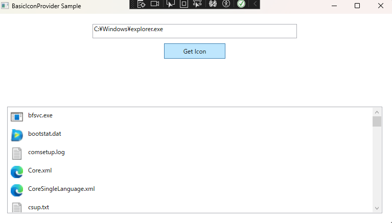

# BasicIconProvider

**BasicIconProvider** is a **minimal learning-oriented library** for retrieving  
**file and folder icons in WPF applications**.

It uses Windows `SHGetFileInfo` to provide a **simple, synchronous, low-feature implementation**,  
ideal for developers who want to learn how icon retrieval works in WPF.

---

## 🚀 Features

- Minimal icon retrieval using Windows **SHGetFileInfo**
- Supports **Small / Large** icon sizes
- **Synchronous** processing only
- **No caching**
- **Minimal error handling**
- Built for **WPF (.NET 8)**

This library intentionally keeps functionality simple for educational purposes.  
Advanced features are planned for the Pro version.

---

## 📦 Project Structure
'''/src /BasicIconProvider BasicIconProvider.cs IconSize.cs ShellInterop.cs
/BasicIconProviderSample MainWindow.xaml MainWindow.xaml.cs SampleFileItem.cs'''
- **BasicIconProvider**  
  → Core library (DLL)

- **BasicIconProviderSample**  
  → Sample WPF application demonstrating usage

---

## 🧩 Usage Example

'''csharp
using BasicIconProvider;

var icon = BasicIconProvider.GetIcon(@"C:\Windows\explorer.exe", IconSize.Large);'''

## 🖼 Sample Application

## 📄 License

This project is licensed under the MIT License.  
See the LICENSE file for details.
